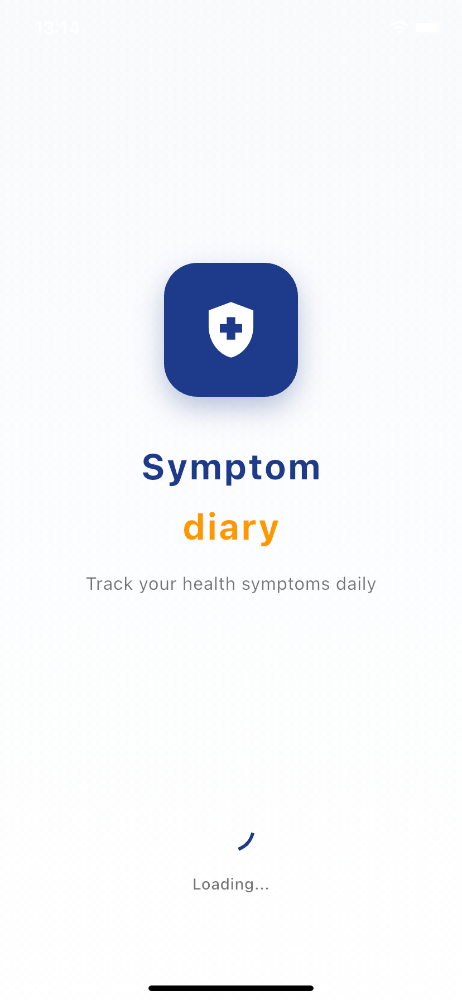
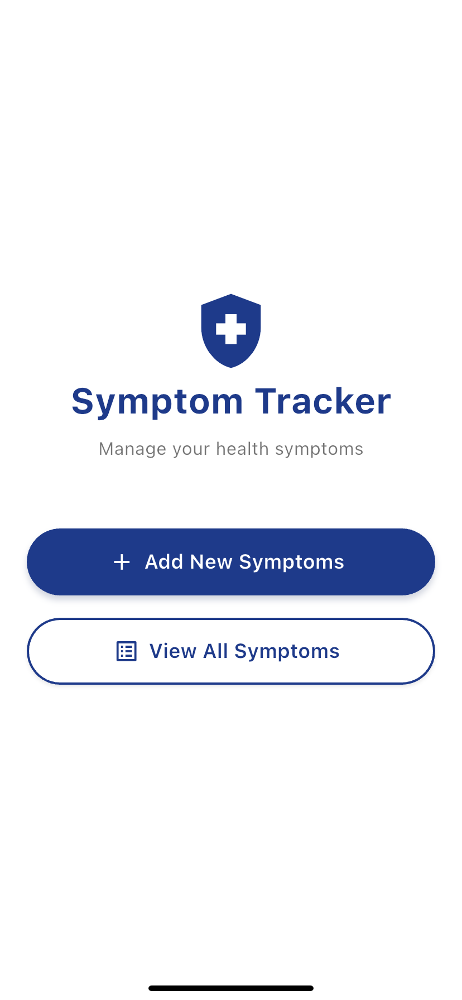
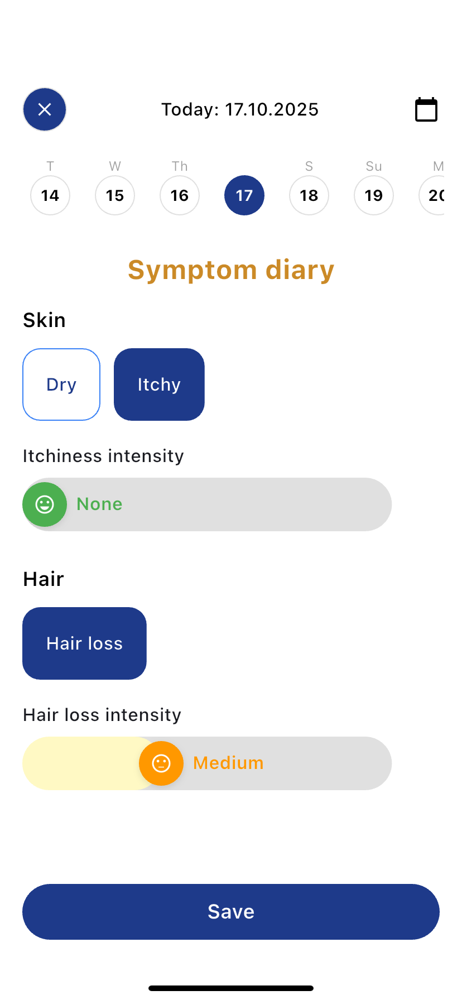
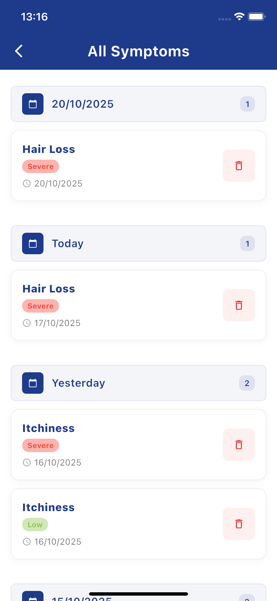

# Symptom Tracker

A Flutter application for tracking daily symptoms with clean architecture and Cubit state management.

## Screenshots

### Splash Screen

*Splash screen displayed at app startup with logo and animated progress indicator*


### 🏠 Main Screen

*Main menu with options to add symptoms or view all symptoms*

### 🎯 Add Symptoms Screen

*Interactive symptom entry form with severity sliders*

### 📋 Symptoms List Screen

*Complete list of all recorded symptoms with date grouping*

## Features

- Add symptoms with name, severity (1-5 scale), and date
- View symptoms for specific dates
- Delete symptoms
- Date navigation and selection
- Local data persistence

## Architecture

This project follows Clean Architecture principles with the following structure:

```
lib/
├── core/
│   ├── constants/
│   ├── errors/
│   ├── usecases/
│   └── di/
│       └── injection_container.dart
└── features/
    └── symptoms/
        ├── domain/
        │   ├── entities/
        │   └── repositories/
        ├── data/
        │   ├── datasources/
        │   ├── models/
        │   └── repositories/
        └── presentation/
            ├── cubit/
            ├── pages/
            └── widgets/
```

## Dependencies

- **flutter_bloc**: State management
- **equatable**: Value equality
- **get_it**: Dependency injection
- **shared_preferences**: Local storage
- **intl**: Date formatting

## Getting Started

1. Install dependencies:
   ```bash
   flutter pub get
   ```

2. Run the app:
   ```bash
   flutter run
   ```

## Usage

1. **Add Symptoms**: Use the form at the top to add new symptoms
2. **View Symptoms**: See all symptoms for the selected date
3. **Navigate Dates**: Use the date selector or arrow buttons
4. **Delete Symptoms**: Tap the delete icon on any symptom card

## State Management

The app uses Cubit for state management with the following states:
- `SymptomInitial`: Initial state
- `SymptomLoading`: Loading state
- `SymptomLoaded`: Successfully loaded symptoms
- `SymptomError`: Error state
- `SymptomAdded`: Symptom added successfully
- `SymptomDeleted`: Symptom deleted successfully