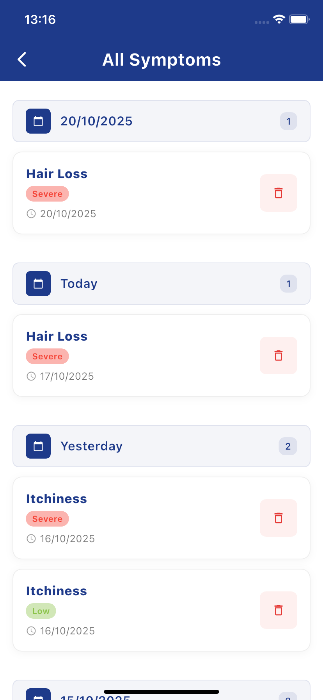

# 📸 Screenshots Guide for Symptom Tracker

This guide explains how to add screenshots to your README file.

## 📁 Directory Structure

```
symptoms_tracker/
├── screenshots/
│   ├── main_screen.png
│   ├── add_symptoms_screen.png
│   ├── symptoms_list_screen.png
│   └── severity_slider.png
└── README.md
```

## 📱 How to Take Screenshots

### Method 1: Using Flutter Emulator/Simulator

1. **Run the app:**
   ```bash
   flutter run
   ```

2. **Take screenshots:**
   - **Android Emulator**: Press `Ctrl + S` or use the camera icon in the emulator toolbar
   - **iOS Simulator**: Press `Cmd + S` or use Device → Screenshot
   - **Physical Device**: Use your device's screenshot function

### Method 2: Using Flutter Screenshot Package

1. **Add dependency to pubspec.yaml:**
   ```yaml
   dev_dependencies:
     screenshot: ^3.0.0
   ```

2. **Take programmatic screenshots:**
   ```dart
   import 'package:screenshot/screenshot.dart';
   
   ScreenshotController screenshotController = ScreenshotController();
   
   // Take screenshot
   await screenshotController.capture();
   ```

## 🎯 Required Screenshots

### 1. Main Screen (`main_screen.png`)
- **What to capture:** The main menu with two buttons
- **Key elements:** "Add New Symptoms" and "View All Symptoms" buttons
- **Description:** Shows the app's entry point

### 2. Add Symptoms Screen (`add_symptoms_screen.png`)
- **What to capture:** The symptom entry form
- **Key elements:** Date selector, symptom buttons (Dry, Itchy, Hair Loss), severity sliders
- **Description:** Shows the interactive form for adding symptoms

### 3. Symptoms List Screen (`symptoms_list_screen.png`)
- **What to capture:** The list of all recorded symptoms
- **Key elements:** Date headers, symptom cards, delete buttons
- **Description:** Shows how symptoms are displayed and organized

### 4. Severity Slider (`severity_slider.png`)
- **What to capture:** The custom interactive slider
- **Key elements:** Moving face icon, color changes, severity text
- **Description:** Shows the unique interactive slider component

## 📝 README Integration

The README already includes the screenshot section. You just need to:

1. **Add the actual image files** to the `screenshots/` directory
2. **Name them exactly** as specified in the README:
   - `main_screen.png`
   - `add_symptoms_screen.png`
   - `symptoms_list_screen.png`
   - `severity_slider.png`

## 🎨 Screenshot Best Practices

### Image Quality
- **Resolution:** Use high-resolution screenshots (at least 1080p)
- **Format:** PNG format for better quality
- **Size:** Keep file sizes reasonable (< 1MB each)

### Content Guidelines
- **Clean UI:** Make sure the app is in a clean state
- **Sample Data:** Add some sample symptoms for the list screen
- **Interactive Elements:** Show the slider in different states
- **Consistent Theme:** Use the same color scheme throughout

### Screenshot Tips
- **Remove personal data:** Don't include any personal information
- **Show key features:** Highlight the main functionality
- **Multiple states:** Show different severity levels on the slider
- **Empty states:** Consider showing empty state for the list

## 🚀 Quick Setup

1. **Create screenshots directory:**
   ```bash
   mkdir screenshots
   ```

2. **Take screenshots** using your preferred method

3. **Save with exact names:**
   - `screenshots/main_screen.png`
   - `screenshots/add_symptoms_screen.png`
   - `screenshots/symptoms_list_screen.png`
   - `screenshots/severity_slider.png`

4. **Test the README:**
   ```bash
   # View the README with images
   cat README.md
   ```

## 📋 Checklist

- [ ] Screenshots directory created
- [ ] Main screen screenshot taken
- [ ] Add symptoms screen screenshot taken
- [ ] Symptoms list screen screenshot taken
- [ ] Severity slider screenshot taken
- [ ] All images are high quality
- [ ] File names match README references
- [ ] README displays images correctly

## 🎯 Example Screenshot Descriptions

```markdown
### 🏠 Main Screen

*Clean main menu with two prominent buttons for navigation*

### 🎯 Add Symptoms Screen  

*Interactive form with date selector and severity sliders*

### 📋 Symptoms List Screen

*Organized list showing symptoms grouped by date*

### 🎨 Interactive Severity Slider

*Custom slider with dynamic face icons and color changes*
```

Your README will look professional and help users understand your app's functionality at a glance! 🎉
